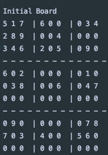
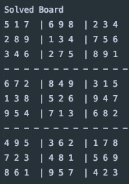
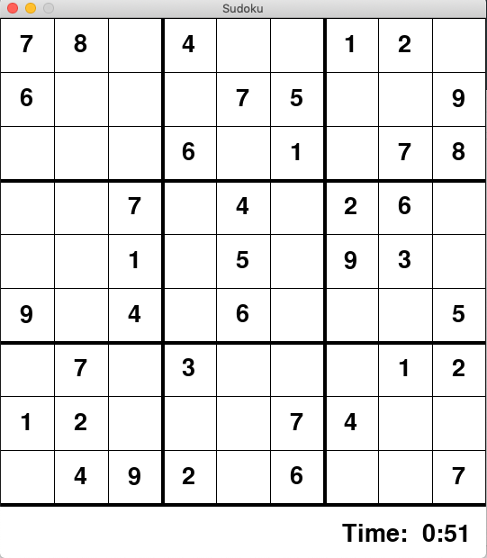

# Sudoku Solver
> Code to solve a sudoku board and a graphical user interface for playing sudoku and veryfying the user input answers.

I have written code to solve a classical 9x9 sudoku board. The solution to the board is displayed as a console output.
I have also created a graphical user interface for playing sudoku, in which the user can input numbers and check if his or her answers are correct

| | ||
|:---:|:---:|:---:|
